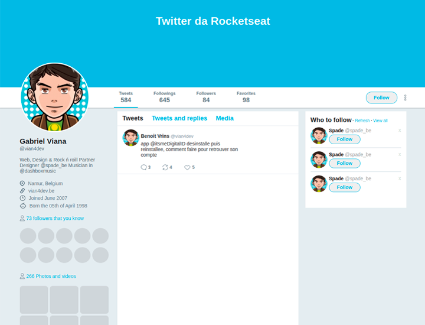

  
  
  
  
  
  
	
  
  
  

  

# Twitter Rocketseat

## ✒️ Descrição
Página réplica do Twitter (versão 2020) desenvolvida na aula de contéudo bônus da _Trilha Ignite_ da Rocketseat, o intuito do desenvolvimento dessa página e colocar em prática os conhecimentos de Flexbox do CSS.

## 🚀 Tecnologias utilizadas

 
  
  

## 📷 Demostração
Apresentação da tela do aplicativo.

  

## 🔥 Instalação
Clone o repositório.
~~~
git clone https://github.com/vian4dev/flexbox-twitter.git
~~~
Acesse o diretório do projeto.
~~~
cd flexbox-twitter/
~~~
Execute o _index.html_ no seu navegador.

## 📝 Licença
Esse projeto está sob a licença MIT. Veja o arquivo [LICENSE](LICENSE) para mais detalhes.

---

 
 
Desenvolvido por - <a href="https://github.com/vian4dev">Gabriel Viana</a> 🤖

 
  

